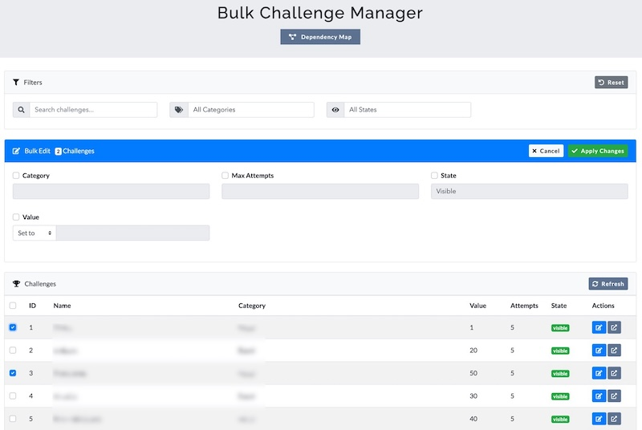
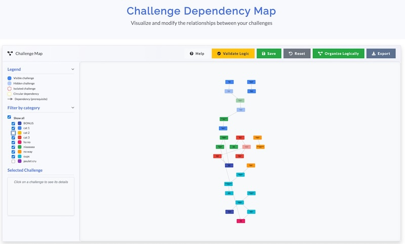

# CTFd Bulk Challenge Manager Plugin

A plugin for CTFd that allows administrators to manage multiple challenges at once and visualize challenge dependencies in an interactive network graph.



## Support the Developer

If you find this plugin useful for your CTF events, consider supporting the developer:

<a href='https://ko-fi.com/D1D11CYJEY' target='_blank'></a>

## Overview

This plugin was developed to streamline challenge management for CTF administrators, making it easier to handle large competition setups with complex dependency relationships between challenges.

## Features

- **Bulk Management:**
  - Edit multiple challenges simultaneously
  - Apply category, value, and state changes in batch
  - Search and filter challenges by various criteria

- **Challenge Dependency Visualization:**
  - Interactive network graph of challenge dependencies
  - Drag-and-drop interface for creating and modifying prerequisite relationships
  - Visual validation of dependency logic (orphan challenges, circular dependencies)
  - Color-coded categories for easy identification

- **Enhanced Flag Management:**
  - Add, edit, and remove multiple flags at once
  - Support for case sensitivity options
  - Compatible with various flag types

- **User-Friendly Interface:**
  - Modern, responsive design
  - Real-time visual feedback
  - Detailed challenge information view

## Installation

1. Create the plugin directory structure in your CTFd installation:
   ```bash
   mkdir -p /path/to/CTFd/plugins/bulk_challenge_manager/templates
   mkdir -p /path/to/CTFd/plugins/bulk_challenge_manager/assets
   ```

2. Copy the plugin files to the appropriate locations:
   - `__init__.py` → `/path/to/CTFd/plugins/bulk_challenge_manager/`
   - `bulk_manager.js`, `challenge_map.js` → `/path/to/CTFd/plugins/bulk_challenge_manager/assets/`
   - `bulk_manager.css`, `challenge_map.css` → `/path/to/CTFd/plugins/bulk_challenge_manager/assets/`
   - Template files → `/path/to/CTFd/plugins/bulk_challenge_manager/templates/`

3. Restart your CTFd instance to load the plugin.

## Usage

### Bulk Challenge Management

1. In the CTFd admin panel, go to **Admin → Bulk Challenge Manager**
2. Use filters at the top to narrow down the challenge list
3. Select challenges using the checkboxes
4. Apply bulk edits using the form at the bottom
5. Save changes with the "Apply Changes" button

### Challenge Dependency Map

1. In the CTFd admin panel, go to **Admin → Challenge Map**
2. View the interactive network of challenge relationships
3. Right-click on a challenge to start creating a dependency
4. Click on another challenge to establish the relationship
5. Click on any challenge to view its details
6. Use the category filters to focus on specific challenge types
7. Click "Check Logic" to validate your challenge dependency structure
8. Click "Save Layout" to persist your arrangement

## How It Works

The plugin adds two main components to CTFd:

1. **Bulk Manager**: A tabular interface for editing multiple challenges with a powerful filtering system
2. **Challenge Map**: A cytoscape.js-powered network visualization of challenge dependencies with an intuitive interface for creating and managing prerequisite relationships

Both components interact with the CTFd database through custom API endpoints to update challenge data and their relationships.

## Requirements

- CTFd v3.0.0 or higher
- Modern web browser with JavaScript enabled

## License

This project is licensed under the MIT License.

## Contributing

Contributions are welcome! Please feel free to submit a Pull Request.

1. Fork the project
2. Create your feature branch (`git checkout -b feature/amazing-feature`)
3. Commit your changes (`git commit -m 'Add some amazing feature'`)
4. Push to the branch (`git push origin feature/amazing-feature`)
5. Open a Pull Request